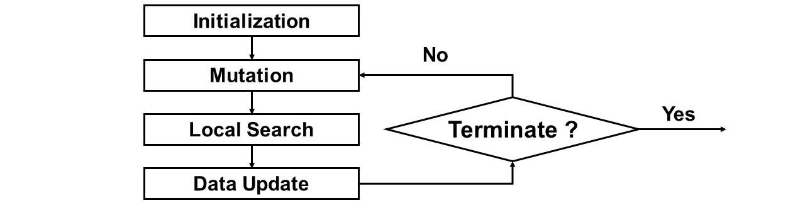
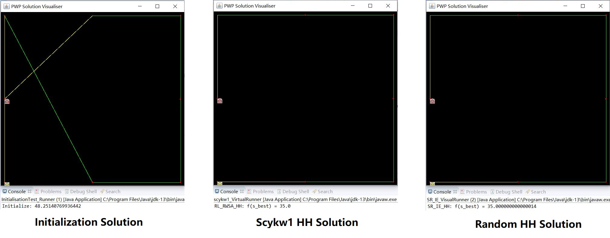
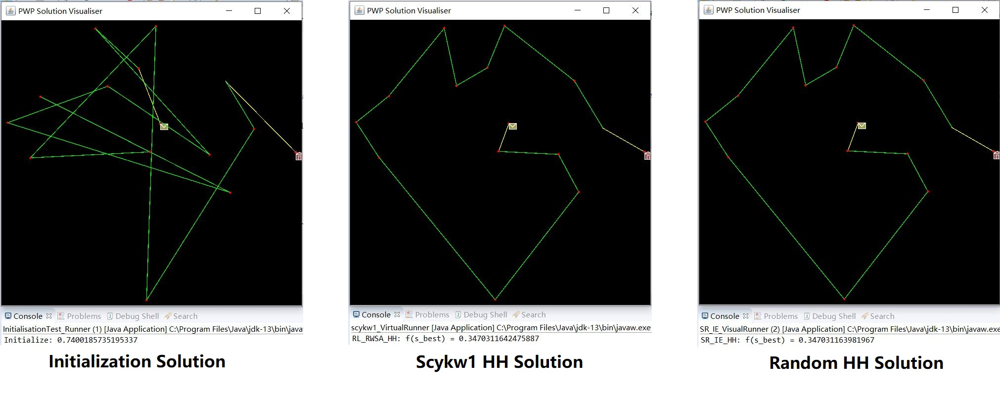
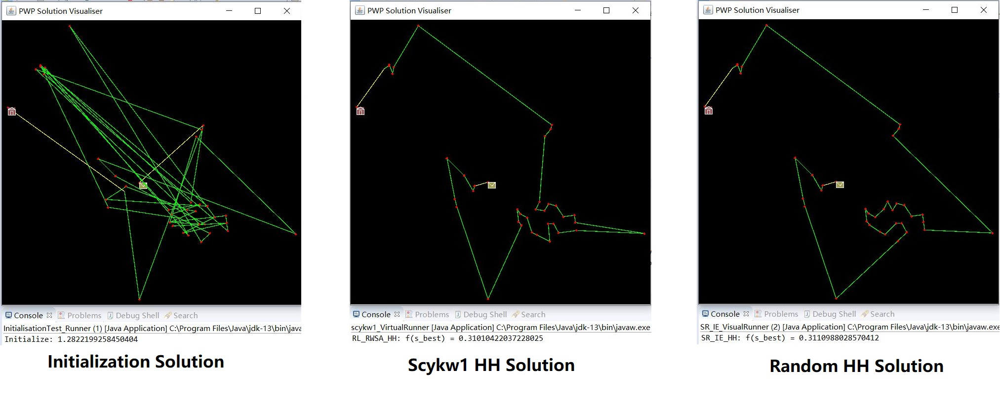
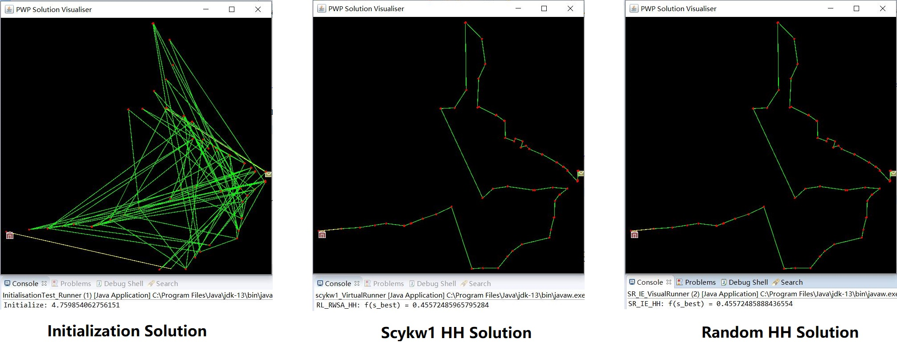
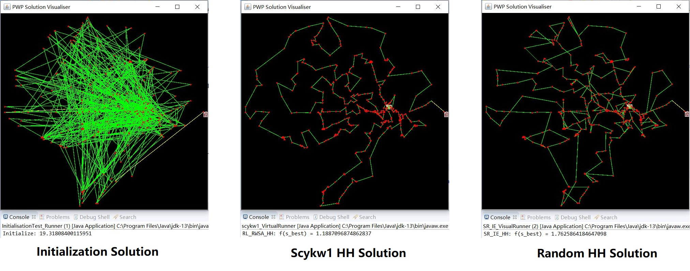
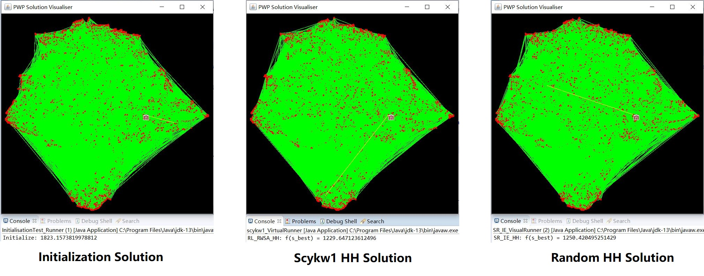

# AIM Project 2020

## Project Description

This is a Java program applied [Hyflex](http://www.asap.cs.nott.ac.uk/external/chesc2011/) framework and typical ai searching methods to solve post worker problems (PWP) with different instances.

----

## Project Structure

```
AIM-PROJECT-2020-SCYKW1
├── out.csv
├── bin
├── lib
├── instances
│   └── pwp
│       |── square.pwp
│       ├── library-15.pwp
│       ├── carparks-40.pwp
│       ├── tramstops-85.pwp
│       ├── trafficlights-446.pwp
│       └── streetlights-35714.pwp
└── src
    ├── heuristic
    ├── hyperheuristics
    ├── instance
    ├── interfaces
    ├── runners
    ├── solution
    ├── test
    ├── testframework
    ├── util
    ├── visualiser
    ├── AIM_PWP.java
    ├── PWPObjectiveFunction.java
    └── SolutionPrinter.java
```

----

## Hyper Heuristic Structure

### Scykw1 Hyper-heuristic


* **Initialization Method**: Randome Initialization (could use constructive, not allowed in coursework)
* **Heuristic Selection**: Roulette Wheel Selection
* **Move Acceptance**: Simulate Annealing with Lundy & Mees cooling
* **Data Update**: Update Roulette Wheel Selection & TTemperature

### Random Hyper-heuristic
* **Initialization Method**: Randome Initialization (could use constructive, not allowed in coursework)
* **Heuristic Selection**: Random Heuristic Selection
* **Move Acceptance**: Improvement Accept Only

Detailed structure could be obtained from the [project report](./Report/scykw1-ProjectReport.pdf)

----

## Sample Output (***1 min results***)

* **Initialization Solution**: The original solution generated by random initialization;
* **Scykw1 HH Solution**: The solution generated from my hyper-heuristic;
* **Random HH Solution**: The solution generated from random hyper-heuristic;

    ### Square -- 6

    

    ### Library -- 15

    

    ### Carparks -- 40

    

    ### Tramstops -- 85

    

    ### Trafficlights -- 446

    

    ### Streetlights -- 35714

    

Since the heuristic selection method needs time for learning, in last instance, scykw1 HH performs worse than random HH.